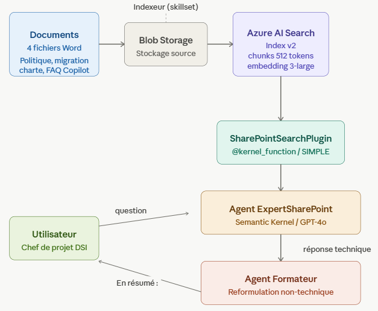

# Agent IA documentaire SharePoint — POC

Agent conversationnel multi-agents basé sur Azure AI Foundry et Semantic Kernel,
permettant à une DSI d'interroger en langage naturel sa documentation SharePoint interne.

## Architecture

## Stack technique

- Azure AI Foundry (GPT-4o, text-embedding-3-large)
- Azure AI Search (RAG, chunking 512 tokens)
- Semantic Kernel 1.41.2 (orchestration multi-agents)
- Python 3.12

## Cas d'usage démontrés

1. Question avec réponse dans les documents → réponse citée et sourcée

Vous : Quel est le quota de stockage maximum pour un site de projet SharePoint ?

Expert : Le quota de stockage maximum pour un site de projet SharePoint est de 50 Go. Pour dépasser le quota par défaut de 10 Go, une demande peut être adressée par le chef de projet référent [Source: 01_Politique_gouvernance_SharePoint.docx].

Formateur : En résumé : Un site de projet SharePoint peut stocker jusqu'à 50 Go de données. Par défaut, il est limité à 10 Go, mais le responsable du projet peut demander d'augmenter cette limite si nécessaire.

2. Question hors périmètre → refus explicite sans hallucination

Vous : Quel est le prix d'une licence Microsoft 365 E5 ?

Expert : Les documents disponibles ne contiennent pas d'information concernant le prix d'une licence Microsoft 365 E5. Je vous recommande de consulter directement le site officiel de Microsoft ou de contacter votre revendeur agréé pour obtenir cette information.

Formateur : En résumé : Je ne connais pas le prix exact d'une licence Microsoft 365 E5. Je vous conseille de vérifier directement sur le site de Microsoft ou de demander à un revendeur officiel pour avoir les informations à jour.

3. Question ambiguë → arbitrage entre sources multiples

Vous : Combien de temps mes documents sont-ils conservés après la migration ?

Expert : La conservation des documents après une migration SharePoint est régie par une politique de rétention automatique mise en place via Microsoft Purview. Les durées sont les suivantes :

1. **Documents RH et contrats** : conservés pendant 10 ans après la fin de leur validité.
2. **Comptes-rendus de réunion** : conservés pendant 5 ans.
3. **Documents de projet** : conservés pendant 3 ans après la clôture du projet.
4. **Brouillons et documents de travail** : supprimés automatiquement après 2 ans sans modification [Source : 01_Politique_gouvernance_SharePoint.docx].

Formateur : En résumé : La durée de conservation de vos documents après une migration dépend de leur type. Par exemple :  
- Les documents RH et contrats sont gardés 10 ans.  
- Les comptes-rendus de réunion, 5 ans.  
- Les documents de projet, 3 ans après la fin du projet.  
- Les brouillons ou documents non modifiés, 2 ans.  

Tout cela est géré automatiquement, vous n’avez rien à faire.

## Installation

[à compléter jeudi]

## Démonstration

[lien screencast à insérer]